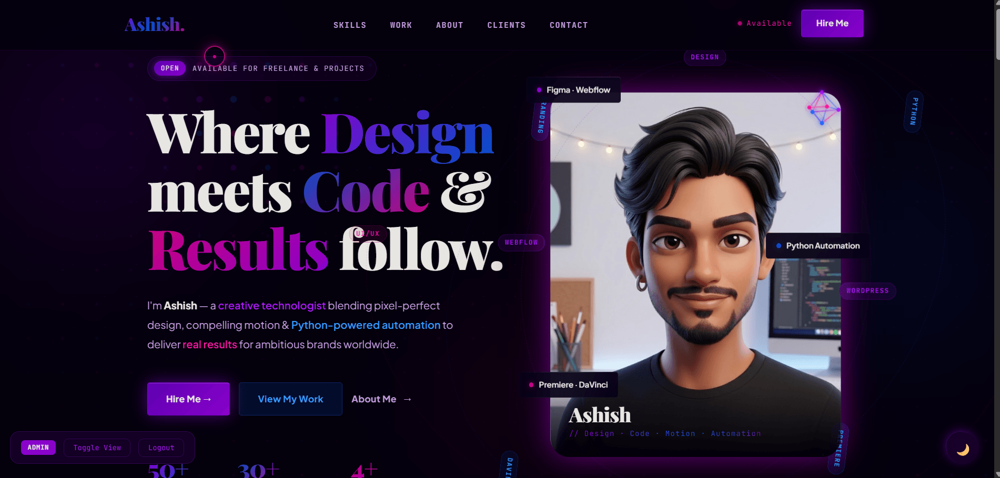
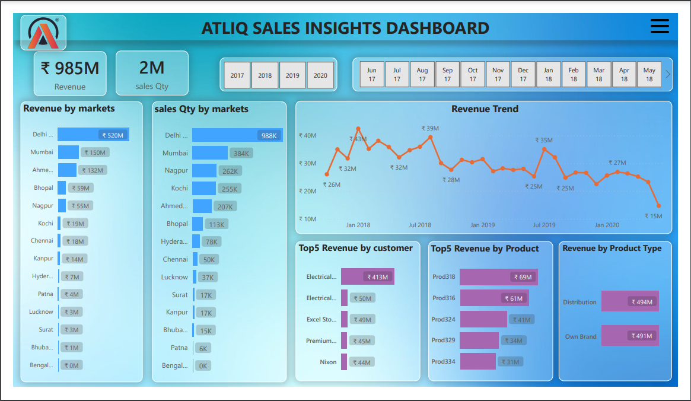

## Hi, I'm Ashish 👋
### Freelance Creative Technologist · Dehradun, India

> *"Where Design meets Code & Results follow."*

I blend **pixel-perfect design**, **Python automation**, and **data storytelling** to deliver real results for ambitious brands. Available for freelance projects worldwide.

---

## 🛠️ Tech Stack

**Languages & Libraries**
`Python` `SQL` `HTML` `CSS` `JavaScript`
`Pandas` `Streamlit` `Flask` `Plotly` `scikit-learn`

**Tools & Platforms**
`Power BI` `Google Sheets API` `Git` `GitHub` `GSAP` `MySQL`

**Services**
`Web Design` `Data Dashboards` `Python Automation` `Video Editing` `AI/Prompt Engineering`

---

## 📌 Featured Projects

| Project | What It Does | Tech |
|--------|-------------|------|
| 📊 [Business Performance Dashboard](#) | Live sales dashboard connected to Google Sheets | Python, Streamlit, Plotly, Pandas, Google Sheets API |
| 💼 [Portfolio Website](#) | Custom-coded portfolio with GSAP animations | HTML, CSS, JavaScript, GSAP |
| 🔍 [AtliQ Sales Insights Dashboard](#) | Power BI dashboard for hardware sales analytics | Power BI, MySQL, ETL, Data Modelling |

---

## 📈 What I'm Up To

- 🔭 Building data tools and automation projects
- 🌱 Expanding into REST APIs and full-stack deployments
- 💬 Open to freelance web design, Python scripts & data dashboard projects
- 📫 Reach me: [LinkedIn](https://www.linkedin.com/in/ashish-yadav-a294212b2/) · [Portfolio](https://my-portfolio-neon-psi-88.vercel.app/)

---

## 📊 GitHub Stats

---

*Available for freelance work · Based in Dehradun, India · Working with clients worldwide 🌍*
